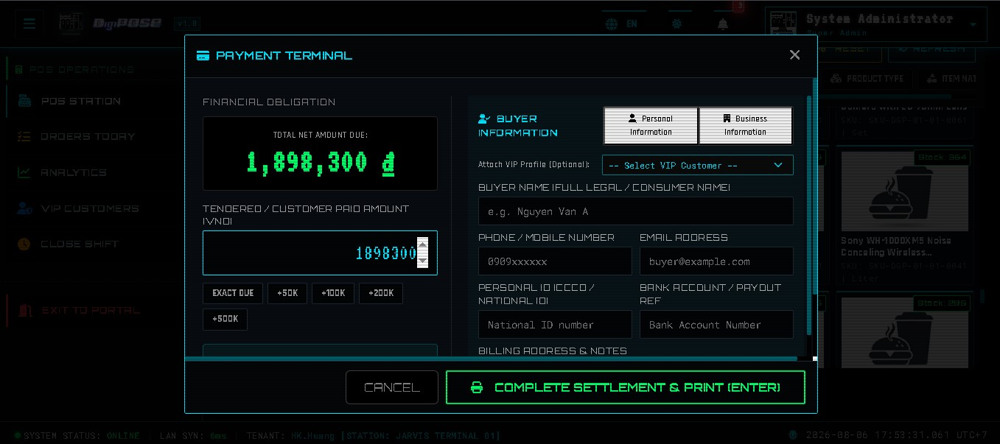

# DigiPOSE Station - E-commerce Store & POS Management Platform
**Official Architecture Overview & Feature Specification Manual (v1.0.0)**

DigiPOSE Station is a robust, high-performance Point of Sale (POS), Enterprise Resource Planning (ERP), and Online E-Commerce platform engineered for scalable retail operations and B2B cloud SaaS distribution. The platform consolidates real-time in-store cashier terminal capabilities, an interactive online storefront, and an administrative backoffice CMS into a unified, low-latency enterprise application server.

---

## 🖥️ Project Visuals & Architecture Showroom

### 1. Core WebApp: Point of Sales (POS) & Executive Analytics
<details open>
<summary><strong>🛒 Click to toggle POS Station HUD & Executive Analytics Suite (7 Modules)</strong></summary>
<br/>

<p align="center">
  
  <br />
  <strong>Main POS Terminal Station HUD</strong><br />
  <em>High-density Cyber-Cinematic cashier terminal featuring O(1) in-memory RAM deduplication, hardware barcode scanner debounce protection, and instantaneous reactive billing calculations.</em>
</p>
<hr/>

<p align="center">
  
  <br />
  <strong>POS Transaction Settlement & Loyalty Point Redemption Offset Engine</strong><br />
  <em>Strict fiscal settlement modal enforcing zero underfunded tendered amounts, automated VAT cent-rounding alignment, and real-time loyalty point conversion (1 PT = 10 ₫).</em>
</p>
<hr/>

<p align="center">
  
  <br />
  <strong>VIP Member Directory & B2B Debt Limit Dashboard</strong><br />
  <em>Real-time loyalty tier tracking, points accrual multiplier calculation (2x for VIP), and instant credit balance recognition for trusted corporate partners.</em>
</p>
<hr/>

<p align="center">
  
  <br />
  <strong>Shift Management & Cashier Revenue Reconciliation</strong><br />
  <em>Atomic shift start/close cash verification, physical currency discrepancy logging, and timestamped shift activity auditing.</em>
</p>
<hr/>

<p align="center">
  
  <br />
  <strong>Executive Analytics Grid & Telemetry Matrix (Revenue & Volume Trends)</strong><br />
  <em>Real-time administrative command bridge displaying hour-by-hour sales velocity, gross transaction volume, and active cashier performance charts.</em>
</p>
<hr/>

<p align="center">
  
  <br />
  <strong>Executive Analytics Grid & Telemetry Matrix (Product Category & Margin Distribution)</strong><br />
  <em>Deep analytical visualization of inventory velocity, high-margin product categories, and dynamic inventory reorder thresholds.</em>
</p>
<hr/>

<p align="center">
  
  <br />
  <strong>Executive Analytics Grid & Telemetry Matrix (Financial & SLA Reports)</strong><br />
  <em>Comprehensive enterprise accounting summary, VAT compliance audit logs, and system health SLA telemetry across all operating counters.</em>
</p>

</details>

---

### 2. Core WebApp: E-Commerce Storefront & Customer Journey
<details open>
<summary><strong>🛍️ Click to toggle E-Commerce Storefront & Customer Portal (8 Modules)</strong></summary>
<br/>

<p align="center">
  
  <br />
  <strong>Dynamic B2B & Retail Commercial Storefront</strong><br />
  <em>Low-latency e-commerce storefront presenting reactive product showcases, real-time availability badges, promotional banners, and optimized server-side rendering (SSR) for enterprise SEO.</em>
</p>
<hr/>

<p align="center">
  
  <br />
  <strong>Multi-Tier Expert Search & Filtering Engine</strong><br />
  <em>High-performance catalog drill-down system enabling instantaneous filtering across dynamic brand taxonomies, technical specifications, price brackets, and full-text queries without page reloads.</em>
</p>
<hr/>

<p align="center">
  
  <br />
  <strong>Reactive Shopping Cart & Item Quantity Engine</strong><br />
  <em>Real-time cart synchronization bridge managing product line items, quantity validations against live inventory stock, and preliminary tax estimates.</em>
</p>
<hr/>

<p align="center">
  
  <br />
  <strong>Storefront Checkout & Vietnam GIS Administrative Topology Selector</strong><br />
  <em>Seamless order submission flow integrating multi-tier GIS location selection (Province/District/Ward), B2B tax invoice data capture, and payment gateway routing.</em>
</p>
<hr/>

<p align="center">
  
  <br />
  <strong>Order Confirmation & Thermal Invoice Spooling</strong><br />
  <em>Instant transaction acknowledgment presenting uniquely generated invoice IDs, estimated delivery SLAs, and verifiable fiscal cryptographic receipts.</em>
</p>
<hr/>

<p align="center">
  
  <br />
  <strong>Customer Order Tracking & ACID Ledger Status Hub</strong><br />
  <em>Transparent consumer dashboard allowing end-to-end tracking of fulfillment pipelines, shipment statuses, and digital historical invoice reprints.</em>
</p>
<hr/>

<p align="center">
  
  <br />
  <strong>Personal Profile & Loyalty Reward Balance Ledger</strong><br />
  <em>Comprehensive identity vault displaying customer loyalty point balances, lifetime expenditure levels, and enterprise account management preferences.</em>
</p>
<hr/>

<p align="center">
  
  <br />
  <strong>Cyber-Cinematic Design System FX & Order Lifecycle Progress Indicators</strong><br />
  <em>Bespoke segmented progress indicators, high-contrast scanline visual layers, and neon status highlights (#00E5FF, #00FF66, #FFB000, #FF3333) engineered for instantaneous visual scannability.</em>
</p>

</details>

---

### 3. Enterprise Backend Management (ERP & CMS Suite)
<details>
<summary><strong>🏢 Click to toggle Enterprise CMS & ERP Administration Hub (6 Modules)</strong></summary>
<br/>

<p align="center">
  
  <br />
  <strong>Administrator Command & Telemetry Dashboard</strong><br />
  <em>Central command hub for system governors, displaying real-time financial KPI metrics, active terminal shift monitoring, revenue charts, and high-density administrative routing grids.</em>
</p>
<hr/>

<p align="center">
  
  <br />
  <strong>Master Data Catalog Control Sub-System</strong><br />
  <em>Comprehensive entity administration center managing dynamic SKU structures, barcode binding, measurement unit transformations, and multi-level product category classifications.</em>
</p>
<hr/>

<p align="center">
  
  <br />
  <strong>Real-Time RAM & Physical Inventory Governance</strong><br />
  <em>O(1) in-memory stock management ledger backed by atomic SQL database synchronization, automated stock restoration upon order voids, and real-time SignalR low-stock alerting.</em>
</p>
<hr/>

<p align="center">
  
  <br />
  <strong>Sales & Financial Billing Operations Module</strong><br />
  <em>Real-time electronic invoice verification and transaction auditing, powered by an enterprise VAT Balancing Engine that guarantees 100% cent-precision accounting ledger alignment.</em>
</p>
<hr/>

<p align="center">
  
  <br />
  <strong>B2B Commercial Partners & CRM Directory</strong><br />
  <em>Enterprise relationship database managing VIP customer tiers, corporate tax compliance parameters (Tax Code MST & Company names), and upstream supply chain vendors.</em>
</p>
<hr/>

<p align="center">
  
  <br />
  <strong>Zero-Trust IAM & RBAC Security Governance</strong><br />
  <em>Fine-grained Role-Based Access Control portal administering granular execution privileges, operator group memberships, and secure credential policies across all terminal tiers.</em>
</p>

</details>

---

### 4. Security & Identity Gateway
<details>
<summary><strong>🔐 Click to toggle Authentication & Zero-Trust Access Portal (2 Modules)</strong></summary>
<br/>

<p align="center">
  
  <br />
  <strong>System Login & Resilient Bot Defense Gateway</strong><br />
  <em>Featuring a cyber-cinematic dark glassmorphism canvas, high-density typography brand cards, and integrated Cloudflare Turnstile bot protection with resilient backend Exponential Backoff verification.</em>
</p>
<hr/>

<p align="center">
  
  <br />
  <strong>Enterprise User Registration & Identity Enrollment</strong><br />
  <em>Seamless operator onboarding workflow equipped with strict real-time input validation, interactive visual feedback, and automated threat interception.</em>
</p>

</details>

---

## 🏛 1. System Architecture Overview

DigiPOSE Station adopts a high-performance, low-latency **ASP.NET Core Decoupled MVC Monolith** architecture. By consolidating Server-Side Rendering (Razor/MVC), high-density reactive JavaScript HUDs, and real-time WebSocket messaging onto a single unified enterprise application server, the platform achieves instant transactional performance with zero multi-hop network overhead:

```
               [ UNIFIED WEB TERMINALS & CLIENT INTERFACES ]
          (ASP.NET Core Razor SSR / Vanilla CSS / jQuery & SignalR)
          ├── E-Commerce Storefront ---> http://localhost:5128/Home/Storefront
          ├── POS Cashier Terminal  ---> http://localhost:5128/POS
          ├── Storefront Cart/Check ---> http://localhost:5128/Home/Storefront/Checkout
          └── Administrator Backoffice-> http://localhost:5128/
                                │
                 (AJAX / JSON Web API / WebSocket SignalR)
                                │
                                ▼
               [ ASP.NET CORE 10 MVC & API ENGINE ]
                         (http://localhost:5128/)
         ┌──────────────────────┴──────────────────────┐
         ▼                                             ▼
[ ADMINISTRATOR & MVC UI ]              [ STATELESS JSON REST API ]
 (Controllers / Razor Views)            (Controllers/Api/ -> Fast JSON)
 ├── Master Data Management (30 Ctrl)   ├── POS Operations & Shifts (PosController)
 ├── Financial Analytics & SLA Reports  ├── Vietnam GIS Topology (GisController)
 └── Zero-Trust RBAC Governance         └── Real-Time WebSockets (PosRealtimeHub)
         │                                             │
         └──────────────────────┬──────────────────────┘
                                │
               [ SERVICES & RESILIENCE WORKERS ]
               ├── IInventoryRAMService (O(1) In-Memory Dedupe)
               ├── IVatBalancingEngine (Cent-Precision VAT Alignment)
               ├── IGisResilienceService (Offline-First GIS Snapshotting)
               ├── ICloudflareTurnstileService (Resilient Bot Defense)
               ├── InventoryWarmupWorker (RAM Pre-loader)
               └── ResilientInvoiceWorker (Async MailKit SMTP Queue)
                                │
                  (Entity Framework Core 10)
                                ▼
                 [ SQL SERVER DATABASE ENGINE ]
```

---

## ✨ 2. Implemented Features & Core Capabilities

### 🛒 A. High-Speed Cashier POS Terminal (`/POS` & `PosController.cs`)
* **O(1) In-Memory Stock Deduction**: Pre-deducts and validates product stock instantly via `IInventoryRAMService` (<15ms latency) before executing Entity Framework database commits.
* **Hardware Debounce Guard**: Integrated `IMemoryCache` TTL buffer prevents accidental double-scanning from physical laser barcode scanners.
* **VAT Rounding & Balancing Engine (`VatBalancingEngine.cs`)**: Implements an enterprise VAT cent balancing algorithm (`Round(Sum(PreTax) * TaxRate, 2)` vs line-item rounding) that injects tax variance directly into the primary line item, guaranteeing a 100% financial ledger match.
* **Loyalty Point Redemption & Offset Engine**: Allows cashiers to dynamically redeem customer loyalty points (`Rate: 1 PT = 10 ₫ Discount`) directly during settlement. Enforces strict ceiling locks against database balances and order totals.
* **Strict Tender Cash Firewall**: Zero-trust verification across both UI execution layers and server-side ACID transactions (`PosController.cs`), strictly rejecting any tendered payment below the required net order due amount.
* **Dual-Layer Idempotency Safeguard**: RAM cache checks combined with SQL unique constraint locks eliminate duplicate transaction processing during unstable network connectivity.
* **Shift & Counter Management**: Open/close cashier shifts, verify physical cash drawers, and track terminal counters (`ShiftsController`, `CountersController`).

### 🌐 B. Online E-Commerce Storefront (`/Home/Storefront`, `/Checkout` & `StorefrontController.cs`)
* **Dynamic Product Catalog**: High-performance multi-tier filtering across dynamic brand taxonomies, technical categories, price brackets, and full-text queries without page reloads.
* **Reactive Shopping Cart**: AJAX-driven cart management supporting instantaneous quantity validation against live database inventory levels.
* **Vietnam GIS Administrative Topology Engine (`GisController.cs`, `GisResilienceService.cs`)**: Seamless multi-tier address selection (Province -> District -> Ward) protected by **Offline-First Disk Snapshotting** (`wwwroot/data/gis_offline_cache`) and Polly resilience pipelines, guaranteeing checkout stability even during external API network outages.
* **Atomic Order Checkout**: Calculates delivery fees, captures B2B corporate invoice requirements (Company Name & MST Tax Code), and wraps execution in isolated SQL transactions (`BeginTransactionAsync`).

### 📡 C. Real-Time Telemetry & SignalR Broadcasting (`PosRealtimeHub.cs`)
* **Instant Stock Synchronization**: Broadcasts inventory updates (`OnStockChanged`) across all active POS terminals and storefronts within <1ms.
* **Low Stock Alerts**: Automatic alert dispatching (`LowStockAlerts <= 5`) to operating cashier stations and store administrators.
* **Live Order Arrival**: Pushes real-time web order notifications (`WEB_ORDER_CREATED`) directly to administrative HUD command monitors.

### 🛡️ D. Resilient Security & Bot Defense (`CloudflareTurnstileService.cs`)
* **Zero-Friction Turnstile Verification**: Fully integrated Cloudflare Turnstile CAPTCHA solution defending Login and Registration endpoints against automated threats.
* **Resilient Exponential Backoff**: Intelligent HTTP retry mechanism handling cloud communication failures gracefully without degrading user experience.
* **SecOps Credential Isolation**: Pre-commit guardrails isolating sensitive configurations into `.example` template schemas (`appsettings.example.json`) while shielding actual secrets via strict `.gitignore` rules.

### ⚡ E. Asynchronous Background Engine (`Services/Background/`)
* **`InventoryWarmupWorker`**: Pre-loads active branch inventory levels into high-speed RAM memory immediately on ASP.NET Core startup.
* **`ResilientInvoiceWorker`**: Asynchronous background queue executing electronic invoice generation and MailKit SMTP email delivery without blocking payment checkout threads.

### 🏢 F. Enterprise Backoffice CMS (`/Administrator` & `Areas/Administrator/`)
* **30 Master Data Controllers**: Complete administrative CRUD for 26 database entities (Products, Inventories, Categories, Suppliers, Customers, Manufacturers, Units, Tax Types, Payment Methods, etc.).
* **Inventory Restoration & Order Safeguard (`OrdersController.cs`)**: Cancelling or deleting orders automatically restores RAM stock (`RestoreStock`), logs audit vouchers (`InventoryTransactions`), and notifies POS terminals via SignalR.
* **Zero-Trust RBAC & IAM**: Fine-grained Role-Based Access Control (`Permissions`, `Roles`, `UserRoles`), BCrypt password hashing, and secure session management.
* **Cyber-Cinematic HUD UI**: High-density military lab aesthetic featuring a custom dark glassmorphism canvas (`#000000`), neon status indicators (`#00E5FF`, `#00FF66`, `#FFB000`, `#FF3333`), segmented progress bars, and scanline FX.

---

## 📁 3. Repository Structure

```
digipose/
├── backend/                         # Backend enterprise monolithic solution (.NET SDK 10.0)
│   └── DigiPOSE/                    # ASP.NET Core MVC & RESTful Web API application
│       ├── Areas/                   # Administrator Backoffice CMS MVC views and controllers (30 Controllers)
│       ├── Controllers/             # MVC Controllers and API REST Endpoints (Controllers/Api/ -> PosController, GisController)
│       ├── Hubs/                    # Real-Time WebSocket Hubs (PosRealtimeHub)
│       ├── Models/                  # EF Core Entities, Database Context, and DTO Schemas
│       ├── Services/                # Business logic, RAM inventory manager, GIS resilience, Turnstile verifier & VAT balancing engine
│       │   └── Background/          # Hosted workers (InventoryWarmupWorker, ResilientInvoiceWorker)
│       ├── Views/                   # Razor Server-Side Web views (POS terminal, Storefront, Home, Checkout)
│       └── wwwroot/                 # Static styles, javascript libraries, uploaded product media & offline GIS cache
├── docs/                            # System deployment architecture & functional domain specifications
└── assets/                          # System branding, architecture visual showcases, and interface telemetry media
```

---

## 💻 4. Technology Stack & Prerequisites

### Technology Stack
* **Backend & Web Monolith Runtime**: .NET 10.0 SDK, ASP.NET Core MVC, ASP.NET Core Web API, SignalR.
* **Database & ORM**: Microsoft SQL Server 2022+, Entity Framework Core 10, System.Linq.Dynamic.Core.
* **Frontend & Styling**: Razor Server-Side Rendering, Vanilla CSS (Cyber-Cinematic Design System), jQuery, Vanilla JavaScript AJAX HUDs.
* **Resilience & Background Services**: Microsoft.Extensions.Caching.Memory (O(1) RAM Cache & Offline GIS Snapshotting), MailKit (SMTP Receipt Dispatch).
* **Security & Governance**: Cloudflare Turnstile (Anti-Bot Gateway), BCrypt.Net-Next (Hash Encryption), Secure Session & Role-Based Access Control.

### Prerequisites & Required Tooling
* [.NET SDK 10.0+](https://dotnet.microsoft.com/download/dotnet/10.0)
* [Microsoft SQL Server (2019/2022) or SQL Server Developer/Express](https://www.microsoft.com/en-us/sql-server)
* [Git Version Control](https://git-scm.com/)

---

## 🚀 5. Build, Installation & Execution Guide

### Step 1: Clone Repository & Configure Database Connection
1. Clone the project repository:
   ```powershell
   git clone <repository_url>
   cd digipose
   ```
2. Open `backend/DigiPOSE/appsettings.example.json` (or your local copy) and configure your database connection string:
   ```json
   "ConnectionStrings": {
     "DefaultConnection": "Server=localhost;Database=DigiPOSE;Integrated Security=True;TrustServerCertificate=True;"
   }
   ```

### Step 2: Apply Database Migrations & Seeding
Navigate to the backend app directory and run EF Core migrations:
```powershell
cd backend/DigiPOSE
dotnet ef database update
```

### Step 3: Start ASP.NET Core Enterprise Server
Launch the unified web application server:
```powershell
dotnet run
```
Default endpoint access URLs:
* **In-Store POS Terminal**: `http://localhost:5128/POS`
* **Online E-Commerce Storefront**: `http://localhost:5128/Home/Storefront`
* **Administrator Command Center**: `http://localhost:5128/`
* **POS REST API Gateway**: `http://localhost:5128/api/v1/pos/catalog/products`

---

## 🏗 6. Production Build & Deployment Guide

### Release Bundle Production Publishing
To compile the monolithic production build with optimized server assets and pre-compiled Razor views:
```powershell
cd backend/DigiPOSE
dotnet publish -c Release -o ./publish
```

---

## 🔐 7. Enterprise Security & Ledger Guardrails
* **Secret & Credential Isolation**: All credentials, Turnstile keys, database connections, and SMTP tokens are strictly shielded via `.gitignore` and configured through isolated environment variables or `.example` templates.
* **Zero-Trust Settlement Security**: Both frontend checkout scripts and backend transactional controllers strictly enforce financial solvency; underfunded payments are immediately intercepted and rejected.
* **ACID Financial Transactions**: All order checkouts, stock deductions, and loyalty point redemptions execute within atomic `BeginTransactionAsync` scopes with automatic rollback handling to guarantee zero data corruption.
